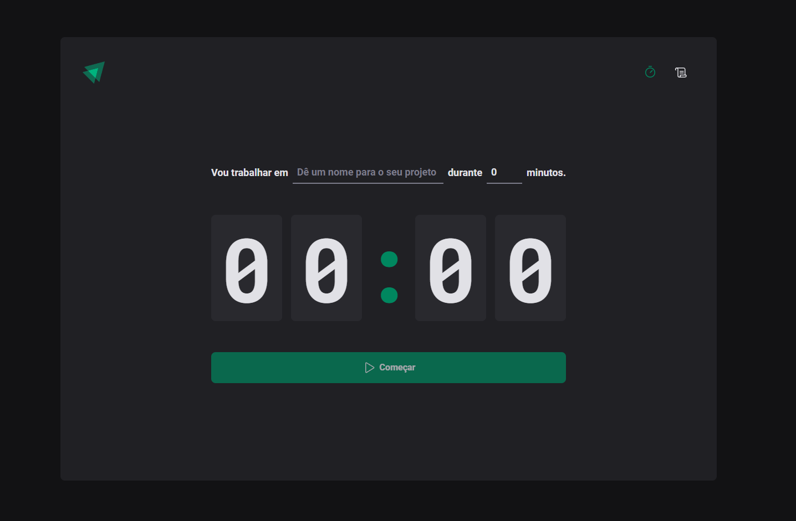
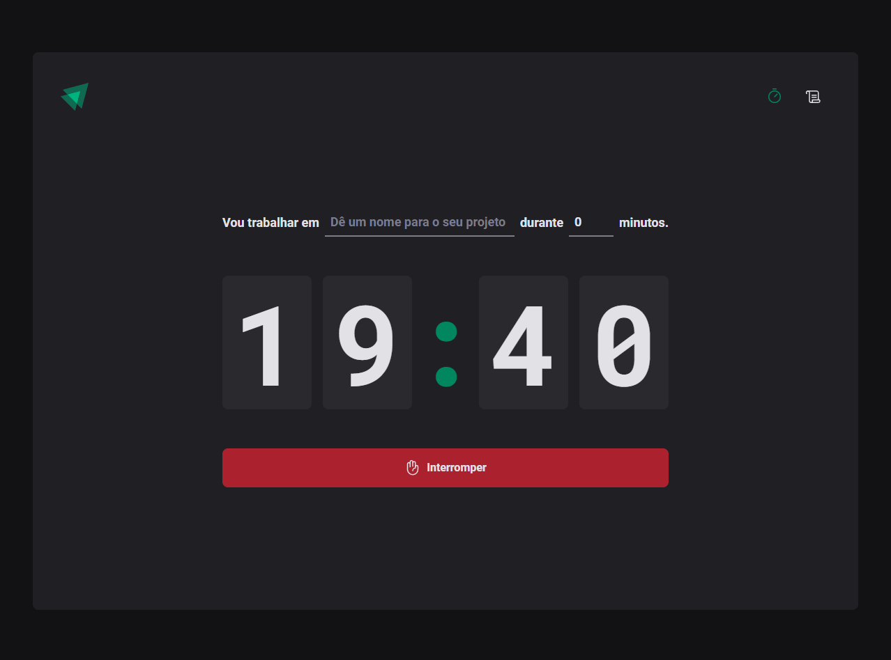
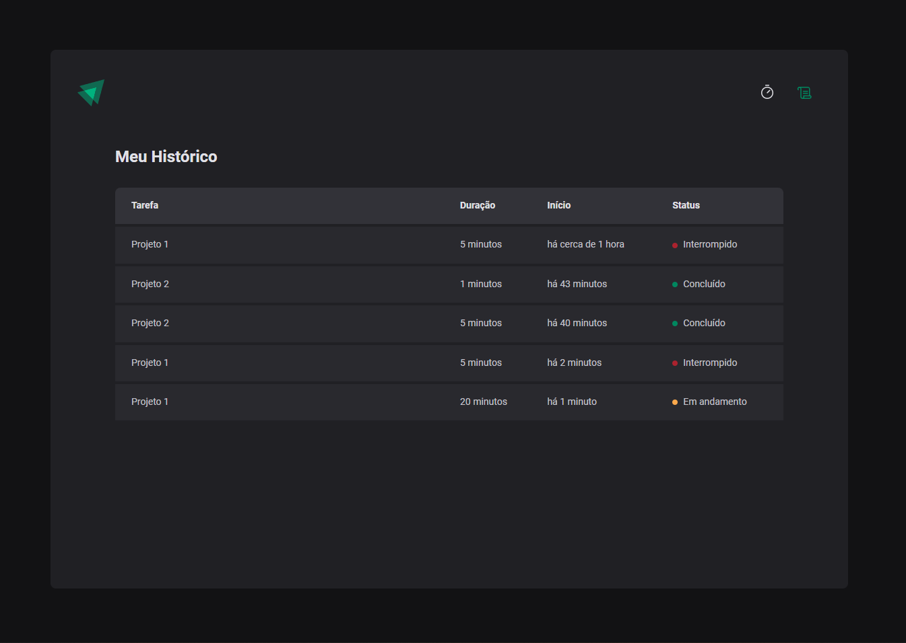

# Ignite Timer

<div align="center">

</div>


 ***<h1> Projeto </h1>***
<div align="center">
 <h2>Projeto desenvolvido durante o curso ReactJS na @rocketseat.</h2><br>

   Criação de um cronômetro para atividades<br>
   Registros de históricos de atividades<br>
   Históricos armazenado anteriormente <br>
</div>
<br><br>
<div align="center">


</div>

***<h1> Iniciando projeto </h1>***

```
terminal:

# clone o repositório do github
$ git clone https://github.com/allesoares95/ignite-timer

# acessar a pasta do projeto pelo terminal 
$ cd ignite-timer

# instalação das dependências
$ npm i

# rodar aplicação
$ npm run dev

# aplicação será aberta no http://localhost:5173
```
<br><br>


 ***<h1> Ferramentas utilizadas no projeto </h1>***

 ``` 
 CSS styled-components - aprimorando estilização do React

 ESLint - utilização para um código padrão 

 React Router Dom - lidando com várias rota

 Phospor React - utilização de icons

 React Hook Form / resolvers / zod - utilização de formulários

 Date fns - Manipulação de datas

 Reducer - formatação de dados complexos

 Context API - utilizando useState, useEffect e useContext

 ImmerJS - Trabalhando com imutabilidade 
 ```

## Utilizando CSS styled-components

`npm i styled-components`

`npm i @types/styled-components -D`

---

## utilização de estilos apenas com TypeScript 
  
* Sobre escrevendo tipagens de uma biblioteca existente 

  * Tipagem de temas
  * arquivo styles.d.ts
  * defaultTheme
<br>

## ESLint 

instalando como dependência de desenvolvimento

` npm i eslint -D`

pacote da rocketseat ;

`npm i @rocketseat/eslint-config -D`

para testar e corrigir erros ;

`npx eslint src --ext .ts,.tsx --fix`

para deixar automatizado o test crie um script no package.json em debug ;

` lint": "eslint src --ext .ts,.tsx --fix `

para rodar ;

` npm run lint `

para fixar os erros 

` npm run lint --fix `

 * Caso queira ver as configurações utilizadas nesse plugin, você pode acessar o repositório oficial com o código dessas configurações para o React: https://github.com/Rocketseat/eslint-config-rocketseat/blob/main/react.js

 * O ESLint possui uma enorme lista de rules (regras) que você pode configurar, e todas estão disponíveis através desse link da documentação oficial: https://eslint.org/docs/rules/

 * Caso queira ver mais sobre como configurar o ESLint manualmente, você pode ver o guia de Getting Started do ESLint disponível no seguinte link: https://eslint.org/docs/user-guide/getting-started


<br><br>

## Lidando com várias rotas.

Utilizar react router dom 

` npm i react-router-dom `

conectando componente Router com outras pages;

### Utilização de icons
`npm i phosphor-react `

### Biblioteca para utilização de formulários
React Hook Form.
`npm install react-hook-form`

### Biblioteca de validação 
Zod ; https://github.com/colinhacks/zod

`npm i zod`

`npm i @hookform/resolvers`

### pacote para datas date-fns
`npm i date-fns`

## ImmerJS
Utilização da biblioteca ImmerJS, para trabalhar com dados imutáveis.

<br>

` npm i immer `
## Utilização de Context API
-> Permite compartilharmos informações entre vários componentes ao mesmo tempo.


Utilização de Contexto do activeCycle se for alterada no NewCycleForm era será 
altera em todos que estão utilizando o mesmo contexto;
Utilização sem propriedades nos componentes e mesmo assim eles conseguem acessar 
uma informação do componente pai da Homepage;

```tsx
import { createContext, useContext, useState } from 'react'

const CyclesContext = createContext({} as any)

function NewCycleForm() {
  let { activeCycle, setActiveCycle } = useContext(CyclesContext)

  return (
    <h1>
      NewCycleForm: {activeCycle}
      <button
        onClick={() => {
          setActiveCycle = 2
        }}
      >
        Alterar ciclo ativo
      </button>
    </h1>
  )
}

function Countdown() {
  const { activeCycle } = useContext(CyclesContext)

  return <h1>Countdown: {activeCycle}</h1>
}

export function Home() {
  const [activeCycle, setActiveCycle] = useState(0)

  return (
    <CyclesContext.Provider value={{ activeCycle, setActiveCycle }}>
      <div>
        <NewCycleForm />
        <Countdown />
      </div>
    </CyclesContext.Provider>
  )
}
```
<br><br>

